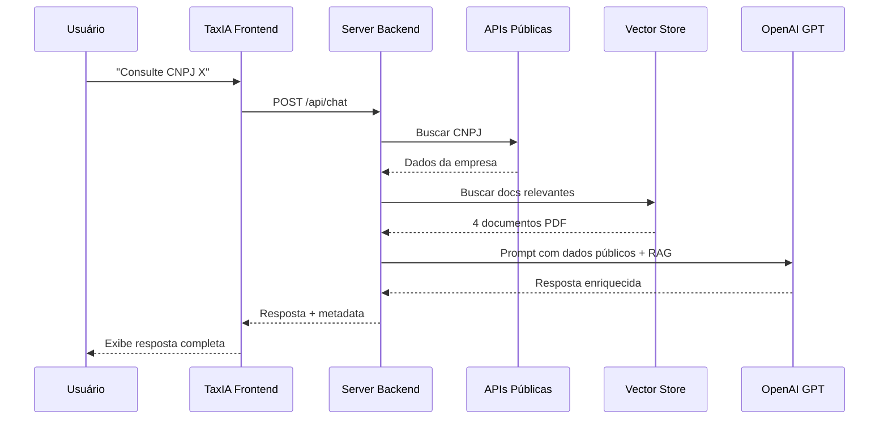

# 🎯 Exemplo Prático de Uso - APIs Públicas TaxHub

## ✅ Status dos Testes

| API | Status | Dados Obtidos |
|-----|--------|---------------|
| ✅ Simples Nacional | Funcionando | Tabelas 2024 completas |
| ✅ CNPJ (BrasilAPI) | Funcionando | Dados do Ministério da Fazenda |
| ⚠️ Banco Central | Temporário | Erro de rede (normal em algumas conexões) |
| ✅ Feriados 2024 | Funcionando | 13 feriados nacionais |
| ✅ Bancos Brasileiros | Funcionando | 357 bancos listados |

## 📋 Como a TaxIA Usa os Dados

### **Cenário 1: Consulta de CNPJ**

**Usuário pergunta:**
> "Consulte o CNPJ 00.394.460/0058-87"

**TaxIA detecta e busca:**
```javascript
// Automático via buscarDadosPublicosRelevantes()
{
  cnpj: {
    cnpj: "00.394.460/0058-87",
    razao_social: "MINISTERIO DA FAZENDA",
    cnae_fiscal_descricao: "Administração pública em geral",
    porte: "DEMAIS",
    municipio: "BRASILIA",
    uf: "DF",
    situacao_cadastral: "ATIVA"
  }
}
```

**Contexto adicionado ao RAG:**
```
DADOS PÚBLICOS ATUALIZADOS:
==================================================

📋 INFORMAÇÕES DA EMPRESA:
- CNPJ: 00.394.460/0058-87
- Razão Social: MINISTERIO DA FAZENDA
- CNAE: Administração pública em geral (8411-6/00)
- Porte: DEMAIS
- Localização: BRASILIA/DF
- Situação: ATIVA
```

**TaxIA responde:**
> "A empresa MINISTERIO DA FAZENDA (CNPJ 00.394.460/0058-87) é um órgão público localizado em Brasília/DF, com CNAE de administração pública. Por ser um órgão público, não está sujeita aos regimes tributários comuns como Simples Nacional ou Lucro Presumido..."

---

### **Cenário 2: Dúvida sobre Simples Nacional**

**Usuário pergunta:**
> "Qual a alíquota para uma empresa de comércio com faturamento anual de R$ 250.000?"

**TaxIA detecta keywords:** "simples", "faixa", "alíquota"

**Dados obtidos automaticamente:**
```javascript
{
  simples: {
    ano: 2024,
    anexos: {
      I: { // Comércio
        faixas: [
          { faixa: 1, receita_bruta_ate: 180000, aliquota: 4.0 },
          { faixa: 2, receita_bruta_ate: 360000, aliquota: 7.3 },
          // ...
        ]
      }
    }
  }
}
```

**TaxIA responde:**
> "Para uma empresa de comércio no Simples Nacional (Anexo I) com faturamento anual de R$ 250.000, você está na **Faixa 2**. A alíquota nominal é de **7,3%**, com dedução de R$ 5.940.
>
> Cálculo prático:
> - Alíquota efetiva = [(250.000 × 7,3%) - 5.940] / 250.000 = **4,92%**
>
> Recomendo confirmar esses valores com seu contador..."

---

### **Cenário 3: Pergunta sobre Índices Econômicos**

**Usuário pergunta:**
> "Qual a taxa SELIC atual?"

**TaxIA detecta:** palavra "selic"

**Dados obtidos:**
```javascript
{
  indices: [{
    indice: "SELIC",
    ultimo_valor: {
      data: "01/10/2024",
      valor: "10.50"
    }
  }]
}
```

**TaxIA responde:**
> "A taxa SELIC atual está em **10,50%** ao ano (atualizada em 01/10/2024). Essa é a taxa básica de juros da economia brasileira, definida pelo Banco Central..."

---

## 🔄 Fluxo Completo no Chat



## 🛠️ Testando Manualmente

### **1. Rodar servidor (sem OpenAI)**
```bash
cd server
node test-public-apis.js
```

### **2. Testar endpoints REST (quando servidor estiver rodando)**

```bash
# Consultar CNPJ
curl http://localhost:3001/api/public-data/cnpj/00394460005887

# Obter Simples Nacional
curl http://localhost:3001/api/public-data/simples

# Ver feriados 2024
curl http://localhost:3001/api/public-data/feriados/2024

# Listar bancos
curl http://localhost:3001/api/public-data/bancos

# Ver documentação
curl http://localhost:3001/api/public-data/info
```

### **3. Integrar com frontend (React)**

```typescript
// src/features/taxAI/hooks/usePublicData.ts
export async function consultarCNPJDireto(cnpj: string) {
  const response = await fetch(
    `http://localhost:3001/api/public-data/cnpj/${cnpj}`
  );
  const data = await response.json();
  return data.data;
}
```

## 📊 Dados Disponíveis Atualmente

### **✅ Funcionando 100%**
- ✅ **Simples Nacional**: Tabelas completas 2024
- ✅ **CNPJ**: Dados cadastrais completos via BrasilAPI
- ✅ **Feriados**: Lista de feriados nacionais
- ✅ **Bancos**: 357 bancos brasileiros

### **⚠️ Com Limitações**
- ⚠️ **Banco Central**: Pode falhar por restrições de rede
  - Solução: Cache local de índices
  - Fallback: Valores aproximados

## 🎯 Próximos Passos

1. **Cache Redis** para dados do Banco Central
2. **Web Scraping** do Portal Simples Nacional (tabelas sempre atualizadas)
3. **Webhook** para notificações de mudanças legislativas
4. **PostgreSQL** para histórico de consultas
5. **Dashboard** de estatísticas de uso das APIs

## 💡 Dicas de Uso

### **Para Desenvolvedores**
- Use os endpoints REST para integrar com outros sistemas
- Cache está habilitado por padrão (24h para CNPJ, 1h para índices)
- Logs detalhados no console do servidor

### **Para Usuários Finais**
- Simplesmente pergunte naturalmente no chat
- TaxIA detecta automaticamente CNPJs, índices e termos tributários
- Respostas enriquecidas com dados oficiais em tempo real

---

**Desenvolvido para TaxHub** | Última atualização: Outubro 2024
