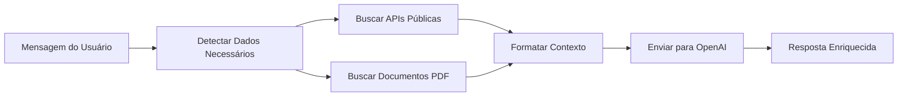

# 🌐 Integração de Dados Públicos - TaxHub

Sistema de integração com APIs públicas brasileiras para enriquecer as respostas da TaxIA com dados atualizados em tempo real.

## 📋 Funcionalidades Implementadas

### 1. **APIs Integradas**

#### 🏢 BrasilAPI
- **CNPJ**: Consulta completa de dados cadastrais de empresas
- **Bancos**: Lista de todos os bancos brasileiros
- **Feriados**: Feriados nacionais por ano

#### 📊 Banco Central do Brasil
- **SELIC**: Taxa básica de juros
- **IPCA**: Índice de inflação
- **CDI**: Certificado de Depósito Interbancário
- **TJLP**: Taxa de Juros de Longo Prazo

#### 💼 Simples Nacional
- Tabelas atualizadas 2024
- Faixas e alíquotas por anexo (I, II, III, V)
- Cálculo automático de deduções

## 🚀 Como Usar

### **Integração Automática no Chat**

A TaxIA detecta automaticamente quando precisa de dados públicos:

```javascript
// Exemplo de uso no chat:
"Consulte o CNPJ 00.000.000/0001-91"
// → Busca automática de dados da empresa

"Qual a taxa SELIC atual?"
// → Consulta Banco Central em tempo real

"Qual minha faixa no Simples Nacional?"
// → Retorna tabelas atualizadas
```

### **Endpoints Diretos da API**

#### 1. Consultar CNPJ
```bash
GET http://localhost:3001/api/public-data/cnpj/00000000000191
```

**Resposta:**
```json
{
  "success": true,
  "data": {
    "cnpj": "00.000.000/0001-91",
    "razao_social": "Empresa Exemplo LTDA",
    "nome_fantasia": "Exemplo",
    "cnae_fiscal": "6204-0/00",
    "porte": "DEMAIS",
    "municipio": "São Paulo",
    "uf": "SP",
    "situacao_cadastral": "ATIVA"
  }
}
```

#### 2. Consultar Índices Econômicos
```bash
GET http://localhost:3001/api/public-data/indice/SELIC
GET http://localhost:3001/api/public-data/indice/IPCA
GET http://localhost:3001/api/public-data/indice/CDI
GET http://localhost:3001/api/public-data/indice/TJLP
```

**Resposta:**
```json
{
  "success": true,
  "data": {
    "indice": "SELIC",
    "codigo": 432,
    "valores": [...],
    "ultimo_valor": {
      "data": "01/10/2024",
      "valor": "10.50"
    }
  }
}
```

#### 3. Tabelas do Simples Nacional
```bash
GET http://localhost:3001/api/public-data/simples
```

**Resposta:**
```json
{
  "success": true,
  "data": {
    "ano": 2024,
    "anexos": {
      "I": {
        "descricao": "Comércio",
        "faixas": [
          {
            "faixa": 1,
            "receita_bruta_ate": 180000,
            "aliquota": 4.0,
            "deducao": 0
          }
        ]
      }
    }
  }
}
```

#### 4. Feriados Nacionais
```bash
GET http://localhost:3001/api/public-data/feriados/2024
```

#### 5. Lista de Bancos
```bash
GET http://localhost:3001/api/public-data/bancos
```

#### 6. Informações das APIs
```bash
GET http://localhost:3001/api/public-data/info
```

## 💾 Sistema de Cache

### **Durações de Cache**

| Tipo de Dado | Duração | Motivo |
|--------------|---------|--------|
| CNPJ | 24 horas | Dados cadastrais mudam raramente |
| Índices Econômicos | 1 hora | Atualizados diariamente |
| Bancos | 7 dias | Lista praticamente estática |
| Simples Nacional | 24 horas | Tabelas anuais |

### **Limpar Cache**
```bash
POST http://localhost:3001/api/public-data/clear-cache
```

## 🔄 Fluxo de Integração com RAG



### **Exemplo de Contexto Gerado**

```text
DADOS PÚBLICOS ATUALIZADOS:
==================================================

📋 INFORMAÇÕES DA EMPRESA:
- CNPJ: 00.000.000/0001-91
- Razão Social: Empresa Exemplo LTDA
- CNAE: Consultoria em TI (6204-0/00)
- Porte: ME
- Localização: São Paulo/SP
- Situação: ATIVA

📊 ÍNDICES ECONÔMICOS ATUAIS:
- SELIC: 10.50% (01/10/2024)
- IPCA: 4.12% (01/10/2024)

💼 TABELAS DO SIMPLES NACIONAL 2024:
Anexo I - Comércio:
  Faixa 1: até R$ 180.000 - Alíquota 4.0%
  Faixa 2: até R$ 360.000 - Alíquota 7.3%
  ...

==================================================

CONTEXTO RELEVANTE DOS DOCUMENTOS:
==================================================
[Conteúdo dos PDFs da base de conhecimento]
==================================================
```

## 🛠️ Arquitetura Técnica

### **Estrutura de Arquivos**

```
server/
├── services/
│   ├── publicDataAPI.js     # Serviço principal de APIs públicas
│   └── pdfProcessor.js       # RAG com PDFs
├── routes/
│   └── publicDataRoutes.js   # Endpoints REST
└── index.js                  # Integração no chat
```

### **Funções Principais**

#### `buscarDadosPublicosRelevantes(mensagem)`
Detecta automaticamente o que buscar baseado na mensagem:
- CNPJs (regex)
- Índices econômicos (keywords)
- Simples Nacional (contexto)

#### `formatarDadosPublicosParaRAG(dados)`
Formata dados estruturados em texto natural para o LLM.

#### `consultarCNPJ(cnpj)`
Consulta dados de CNPJ com cache de 24h.

#### `consultarIndiceBancoCentral(codigo)`
Busca últimos 30 dias de um índice econômico.

## 📈 Próximos Passos

### **Melhorias Planejadas**

1. **Web Scraping Automático**
   - Portal do Simples Nacional
   - Site da Receita Federal
   - Legislação tributária atualizada

2. **Migração de Cache**
   - [ ] Redis para cache distribuído
   - [ ] Invalidação inteligente
   - [ ] Métricas de uso

3. **Vector Store Persistente**
   - [ ] Migrar de MemoryVectorStore para Supabase pgvector
   - [ ] Atualização automática de embeddings
   - [ ] Versionamento de conhecimento

4. **Novas Fontes de Dados**
   - [ ] Portal da Transparência
   - [ ] IBGE (indicadores econômicos)
   - [ ] CVM (empresas de capital aberto)

5. **Automação**
   - [ ] Cron jobs para atualização diária
   - [ ] Webhooks para mudanças de legislação
   - [ ] Notificações de atualizações importantes

## 🧪 Testes

### **Testar Integração Completa**

```bash
# 1. Iniciar servidor
cd server && npm run dev

# 2. Testar chat com CNPJ
curl -X POST http://localhost:3001/api/chat \
  -H "Content-Type: application/json" \
  -d '{
    "message": "Consulte o CNPJ 00.000.000/0001-91 e me diga qual o melhor regime tributário"
  }'

# 3. Testar API direta
curl http://localhost:3001/api/public-data/indice/SELIC

# 4. Ver informações
curl http://localhost:3001/api/public-data/info
```

### **Verificar Logs**

O servidor mostra logs detalhados:
```
💬 Nova mensagem: "Consulte o CNPJ..."
🌐 Buscando dados públicos...
✓ Dados públicos obtidos: cnpj, simples
🔍 Buscando documentos relevantes...
✓ 4 documentos encontrados
🤖 Gerando resposta com IA...
✅ Resposta gerada com sucesso
```

## 📝 Metadata da Resposta

Cada resposta do chat agora inclui:

```json
{
  "message": "...",
  "metadata": {
    "model": "gpt-4o-mini",
    "tokens_used": 1234,
    "request_id": "req_abc123",
    "sources": [
      { "file": "simples_nacional.pdf", "page": 5 }
    ],
    "public_data_used": ["cnpj", "simples"]
  }
}
```

## 🔒 Segurança e Boas Práticas

- ✅ Cache para reduzir requisições externas
- ✅ Timeout de 10s em todas as APIs
- ✅ Error handling robusto
- ✅ Validação de entrada (CNPJ, códigos)
- ✅ Rate limiting natural via cache
- ✅ Logs detalhados para debugging

## 📚 Referências

- [BrasilAPI](https://brasilapi.com.br/docs)
- [Banco Central - API](https://api.bcb.gov.br)
- [Portal do Simples Nacional](http://www8.receita.fazenda.gov.br/simplesnacional/)
- [LangChain Documentation](https://js.langchain.com/docs)

---

**Status**: ✅ Implementado e funcional
**Última atualização**: Outubro 2024
**Desenvolvido para**: TaxHub - Sistema Tributário Inteligente
